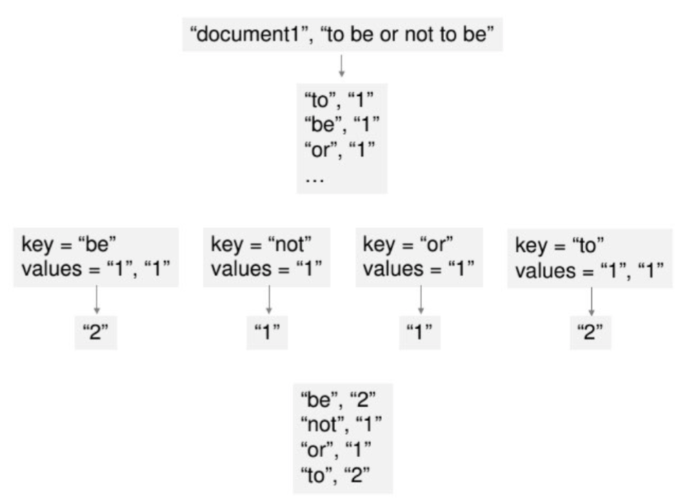

_Unit 3 - Data Engineering -- Sprint 3 - Big Data_

# Scala for Spark

## Why Scala? Why Spark?
Let's compare:
* Hadoop MapReduce in Java
* Spark in Scala

## MapReduce
* Read a lot of data
* **Map:** extract something you care about from each record
* Shuffle and sort 
* **Reduce:** aggregate, summarize, filter, or transform
* Write the results

This outline stays the same. The mapper and reducer change to fit the problem.

### Word Count in MapReduce in Java (a classic example)



Map:
```java
class WordCountMapper extends MapReduceBase
    implements Mapper<IntWritable, Text, Text, 
    IntWritable> {
 
  static final IntWritable one  = new IntWritable(1);
  static final Text word = new Text; 
 
  @Override public void map(IntWritable key, Text valueContents,
      OutputCollector<Text, IntWritable> output, 
      Reporter reporter) {
    String[] tokens = valueContents.toString.split("\\s+");
    for (String wordString: tokens) {
      if (wordString.length > 0) {
        word.set(wordString.toLowerCase);
        output.collect(word, one);
      }
    }
  }
}
```

Reduce:
```java
class WordCountReduce extends MapReduceBase
  implements Reducer<Text, IntWritable, Text,
  IntWritable> { 
 
  public void reduce(Text keyWord,
      java.util.Iterator<IntWritable> counts,
      OutputCollector<Text, IntWritable> output,
      Reporter reporter) {
        
    int totalCount = 0;
    while (counts.hasNext) {
      totalCount += counts.next.get;
    }
    output.collect(keyWord, new IntWritable(totalCount));}
} 
```

MapReduce was ground breaking for enabling **distributed processing** and **fault tolerance**.

* [The Friendship That Made Google Huge](https://www.newyorker.com/magazine/2018/12/10/the-friendship-that-made-google-huge)
* [MapReduce original research paper](https://static.googleusercontent.com/media/research.google.com/en//archive/mapreduce-osdi04.pdf)

## Spark

How did Spark improve upon MapReduce?
* Concise language (Scala)
* Flexible APIs
* Persist data in memory to make piped operations more efficient (vs. Hadoop saves results back to disk)
* Scala is both object-oriented and functional, it's "multi-paradigm"

Word Count in Spark (old RDD API)
```scala
object SparkWordCount {
  def main(args: Array[String]) = {
    val sc = new SparkContext("local", "Word Count")
    
    val input = sc.textFile(args(0)).map(_.toLowerCase)
    input
      .flatMap(line => line.split("""\W+"""))
      .map(word => (word, 1))
      .reduceByKey((count1, count2) => count1 + count2)
      .saveAsTextFile(args(1))
      
    sc.stop()
    }
}
```

## More Spark examples
https://spark.apache.org/examples.html

Compare:
* Scala vs Python
* RDD API vs DataFrame API
* pySpark features can take longer to become available, and the translation is another potential source of error

## Spark vs Dask
[Dask Documentation: Comparison to Spark](https://docs.dask.org/en/latest/spark.html)
* Dask is lighter weight - don't reach too early for Spark and Hadoop which tend to be overused recently
* Dask helps to "scale up" (and "scale out") while Spark and Hadoop are helpful to "scale out"
(Sometimes you'll get to choose what you want, sometimes someone else at your company will)

## Argument for scaling out
> "In pioneer days they used oxen for heavy pulling, and when one ox couldn't budge a log, they didn't try to grow a larger ox. We shouldn't be trying for bigger computers, but for more systems of computers."
> --[Grace Hopper](http://www.cs.yale.edu/homes/tap/Files/hopper-wit.html)

## Argument for scaling up
[Gary Bernhardt tweets about "big data"](https://mobile.twitter.com/search?q=from%3Agarybernhardt%20%22big%20data%22)
