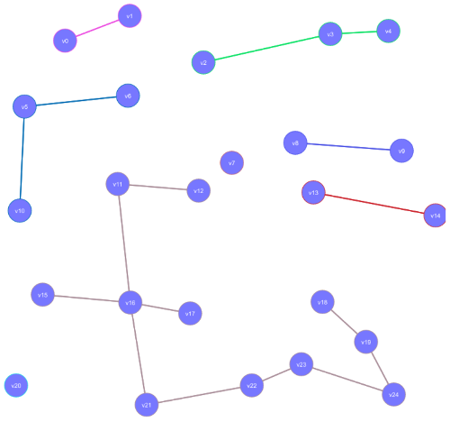

# Connected Components in a Graph

A _connected component_ of a graph is a subgraph where all vertices are
reachable via edges in the subgraph.

Here's an example of a graph with 8 connected components:



(Two of the connected components are single verts.)

## Usefulness of Connected Components

There are a lot of theoretical uses of connected components that are beyond the scope of the course. But on the more practical front, here are some potential uses:

* Look for people you might know in a social network.
* Predict the spread of zombie apocalypse or other disease within social groups.
* Determining which parts of a computer network are reachable from another.
* Finding clusters of related information.

## Finding Connected Components

If you have a BFS or DFS, finding connected components is pretty
straightforward if you modify your search to return a list of verts
visited. (Also modify the search to not always color the verts white at
the start.)

```pseudocode
connected_components = [];

for v in graph.vertexes:
  v.color = white

for v in graph.vertexes:
  if v.color == white:
    component = bfs(v)
	connected_components.push(component);
```

## Exercises

Draw a graph of 8 vertexes with 3 connected components.