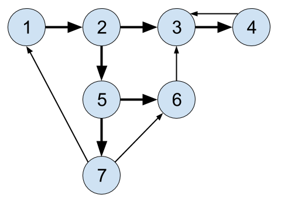

# Depth First Search (DFS)

## Objective

* Learn about one of the more famous graph algorithms
* Learn uses of DFS

## Overview

When searching a graph, one of the approaches is called _depth first
search_. This "dives" "down" the graph as far as it can before needing
to backtrack and explore another branch.

The algorithm never attempts to explore a vert that it either has
explored or is exploring.

For example, when starting from the upper left, the numbers on this
graph show a vertex visitation order in a DFS:



The bold lines show with edges were followed. (The thin edges were not
followed since their destination nodes had already been visited.)

(Of course, the exact order will vary depending on which branches get
taken first and which vertex is the starting vertex.)

## Applications of DFS

* Finding [Minimum Spanning Trees](https://en.wikipedia.org/wiki/Minimum_spanning_tree) of weighted graphs
* Path finding
* Detecting cycles in graphs
* [Topological sorting](https://en.wikipedia.org/wiki/Topological_sorting), useful for scheduling sequences of dependent jobs
* Solving and generating mazes

## Coloring Vertexes

As the graph is explored, it's useful to color verts as you arrive at
them and as you leave them behind as "already searched".

Commonly, unvisited verts are white, verts whose neighbors are being
explored are gray, and verts with no unexplored neighbors are black.


## Recursion

Since we want to pursue leads in the graph as far as we can, and then
"back up" to an earlier branch point to explore that way, recursion is a
good approach to help "remember" where we left off.

Looking at it with pseudocode to make the recursion more apparent:

```pseudocode
explore(graph) {
    visit(this_vert);
    explore(remaining_graph);
}
```

## Pseudocode for DFS

```pseudocode
DFS(graph):
    for v of graph.verts:
        v.color = white
        v.parent = null

    for v of graph.verts:
        if v.color == white:
            DFS_visit(v)

DFS_visit(v):
    v.color = gray

    for neighbor of v.adjacent_nodes:
        if neighbor.color == white:
            neighbor.parent = v
            DFS_visit(neighbor)

    v.color = black

```


## Exercises

* Build a random graph and show a vertex visitation order for DFS.

* One more for good measure.
