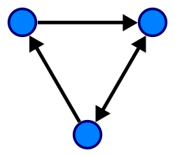
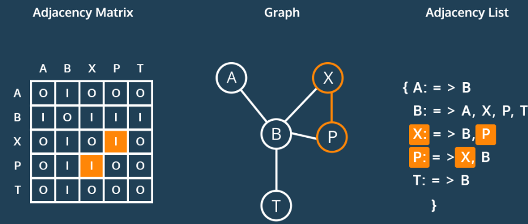
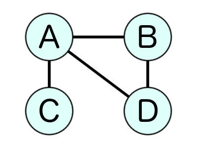
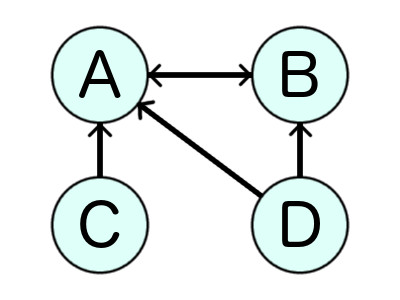
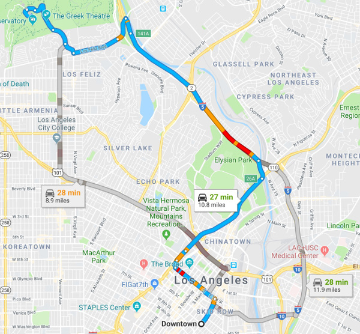

# Intro to Graphs

## Objectives

* Learn what graphs are
* Learn the components of graphs
* Learn what graphs are useful for

## What Are Graphs?

Graphs are collections of related data. They're like trees, except connections can be made from any node to any other node, even forming loops.

The nodes in a graph are called _vertexes_ (or _vertices_ or _verts_), and the connections between the verts are called _edges_.

And edge denotes a relationship or linkage between the two verts.

## What can they represent?

Graphs can represent any kind of multiway relational data.

This could be a collection of cities and linking roads.

It could be a collection of computers on a network.

It could be a population of people who know each other and [Kevin
Bacon](https://en.wikipedia.org/wiki/Six_Degrees_of_Kevin_Bacon).

It could represent trade relationships between nations.

And so on.

## Definitions

### Directed/Undirected Graphs

If the edges are "one way" (have an arrow), the graph is said to be a
_directed graph_. If there are no arrows, the edges are bidirectional
and the graph is an _undirected_ graph.

This is an __undirected graph__ which could represent a social network like Facebook. Alice is friends with Bob, Carol and Dave, Bob is friends with Alice and Dave, Carol is only friend with Alice, and Dave is friends with only Alice and Bob. In this example, the nodes represent people and the edges represent friendship.

This is an __directed graph__ which could represent a social network like Twitter or Instagram. Since Twitter/Instagram follows are one-way as opposed to always-mutual Facebook friendships, they are represented with arrows. In the above directed graph, Alice and Bob follow each other, Dave follows Alice and Bob, and Carol only follows Alice.

### Cyclic/Acyclic Graphs

If a cycle can be formed (e.g. you can follow the edges and arrive again at an already-visited vert), the graph is _cyclic_. Otherwise it is _acyclic_.

### Weighted Graphs

Graphs with values (_weights_) associated with the edges are called _weighted graphs_.

The meaning of the weight is dependent on the type of graph. A graph of road network segments might have weight represent the length of the road. The higher the total weight of a route on the graph, the longer the trip is. The weights can be used to help decide if a particular route should be chosen over another.

Weights can be further modified. For example, if one were building a bicycle map, roads with bad car traffic or very steep uphills could be given unnaturally large weights so a routing algorithm would be unlikely to take them. (This is how Google Maps avoids freeways when you ask it for walking directions.)

### Directed Acyclic Graphs (DAGs)

A _directed acyclic graph_ (_DAG_) has a number of applications. From [Wikipedia](https://en.wikipedia.org/wiki/Directed_acyclic_graph):

> DAGs can model many different kinds of information. A spreadsheet can
> be modeled as a DAG, with a vertex for each cell and an edge whenever
> the formula in one cell uses the value from another; a topological
> ordering of this DAG can be used to update all cell values when the
> spreadsheet is changed. Similarly, topological orderings of DAGs can
> be used to order the compilation operations in a makefile. The program
> evaluation and review technique uses DAGs to model the milestones and
> activities of large human projects, and schedule these projects to use
> as little total time as possible. Combinational logic blocks in
> electronic circuit design, and the operations in dataflow programming
> languages, involve acyclic networks of processing elements. DAGs can
> also represent collections of events and their influence on each
> other, either in a probabilistic structure such as a Bayesian network
> or as a record of historical data such as family trees or the version
> histories of distributed revision control systems. DAGs can also be
> used as a compact representation of sequence data, such as the
> directed acyclic word graph representation of a collection of strings,
> or the binary decision diagram representation of sequences of binary
> choices.

It's notable that git uses a DAG to represent commits. A commit can have a child
commit, or more than one child commit (in the case of a branch). A child could
come from one parent commit, or from two (in the case of a merge). But there's
no way to go back and form a repeating loop in the git commit hierarchy.

## Exercises

Draw examples of the following:

* Undirected graph of 4 verts.
* Directed graph of 5 verts.
* Cyclic directed graph of 6 verts.
* DAG of 7 verts.
