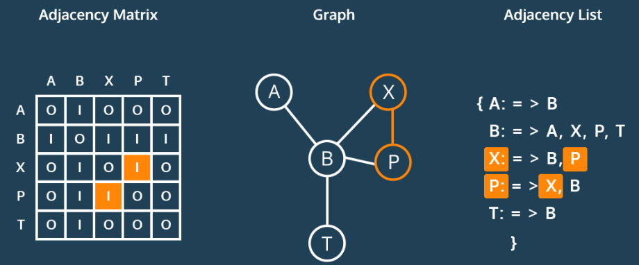
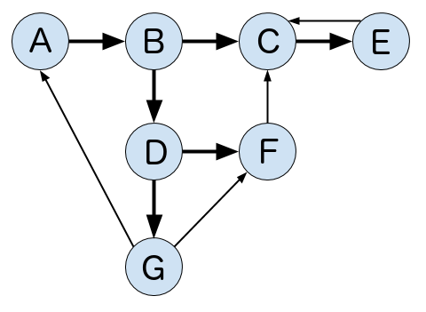

# Intro to Graphs

## Objectives

* Learn how to represent a graph as an adjacency list
* Learn how to represent a graph as an adjacency matrix
* Learn the tradeoffs of the respective representations

## Graph Representations





The two most common ways to represent graphs in code are adjacency lists and adjacency matrices, each with its own strengths and weaknesses. When deciding on a graph implementation, it's important to understand the type of data and operations you will be using.

## Adjacency List

In an adjacency list, the graph stores a list of vertices and for each vertex, a list of each vertex to which it's connected. So, for the following graph...



...an adjacency list in Python could look something like this:

```python
class Graph:
    def __init__(self):
        self.vertices = {
                          "A": {"B"},
                          "B": {"C", "D"},
                          "C": {"E"},
                          "D": {"F", "G"},
                          "E": {"C"},
                          "F": {"C"},
                          "G": {"A", "F"}
                        }
```

Note that this adjacency list doesn't actually use any lists. The `vertices` collection is a `dictionary` which lets us access each collection of edges in O(1) constant time while the edges are contained in a `set` which lets us check for the existence of edges in O(1) constant time.

## Adjacency Matrix

Now, let's see what this graph might look like as an adjacency matrix:

```python
class Graph:
    def __init__(self):
        self.edges = [[0,1,0,0,0,0,0],
                      [0,0,1,1,0,0,0],
                      [0,0,0,0,1,0,0],
                      [0,0,0,0,0,1,1],
                      [0,0,1,0,0,0,0],
                      [0,0,1,0,0,0,0],
                      [1,0,0,0,0,1,0]]
```

We represent this matrix as a two-dimensional array, or a list of lists. With this implementation, we get the benefit of built-in edge weights but do not have an association between the values of our vertices and their index.

In practice, both of these would probably contain more information by including Vertex or Edge classes.


## Tradeoffs

Both adjacency matrices and adjacency lists have their own strengths and weaknesses. Let's explore their tradeoffs.

For the following:

```
V: Total number of vertices in the graph
E: Total number of edges in the graph
e: Average number of edges per vertex
```

### Space Complexity

* **Adjacency Matrix**: O(V ^ 2)

* **Adjacency List**: O(V + E)

Consider a sparse graph with 100 vertices and only one edge. An adjacency list would have to store all 100 vertices but only needs to keep track of that single edge. The adjacency matrix would need to store 100x100=10,000 possible connections, even though all but one would be 0.

Now consider a dense graph where each vertex points to each other vertex. In this case, the total number of edges will approach V^2 so the space complexities of each are comparable. However, dictionaries and sets are less space efficient than lists so for dense graphs, the adjacency matrix is more efficient.

Takeaway: Adjacency lists are more space efficient for __sparse__ graphs while adjacency matrices become efficient for __dense__ graphs.


### Add Vertex

* **Adjacency Matrix**: O(V)

* **Adjacency List**: O(1)

Adding a vertex is extremely simple in an adjacency list:

```Python
self.vertices["H"] = set()
```

Adding a new key to a dictionary is a constant-time operation.

For an adjacency matrix, we would need to add a new value to the end of each existing row, then add a new row at the end.

```Python
for v in self.edges:
  self.edges[v].append(0)
v.append([0] * len(self.edges + 1))
```

Remember that with Python lists, appending to the end of a list is usually O(1) due to over-allocation of memory but can be O(n) when the over-allocated memory fills up. When this occurs, adding the vertex can be O(V^2).

Takeaway: Adding vertices is very efficient in adjacency lists but very inefficient for adjacency matrices.


### Remove Vertex

* **Adjacency Matrix**: O(V ^ 2)

* **Adjacency List**: O(V)

Removing vertices is pretty inefficient in both representations. In an adjacency matrix, we need to remove the removed vertex's row, then remove that column from each other row. Removing an element from a list requires moving everything after that element over by one slot which takes an average of V/2 operations. Since we need to do that for every single row in our matrix, that results in a V^2 time complexity. On top of that, we need to reduce the index of each vertex after our removed index by 1 as well which doesn't add to our quadratic time complexity, but does add extra operations.

For an adjacency list, we need to visit each vertex and remove all edges pointing to our removed vertex. Removing elements from sets and dictionaries is a O(1) operation, so this results in an overall O(V) time complexity.

Takeaway: Removing vertices is inefficient in both adjacency matrices and lists but more inefficient in matrices.


### Add Edge

* **Adjacency Matrix**: O(1)

* **Adjacency List**: O(1)

Adding an edge in an adjacency matrix is quite simple:

```Python
self.edges[v1][v2] = 1
```

Adding an edge in an adjacency list is similarly simple:

```Python
self.vertices[v1].add(v2)
```

Both are constant-time operations.

Takeaway: Adding edges to both adjacency lists and matrices is very efficient.


### Remove Edge

* **Adjacency Matrix**: O(1)

* **Adjacency List**: O(1)

Removing an edge from an adjacency matrix is quite simple:

```Python
self.edges[v1][v2] = 0
```

Removing an edge from an adjacency list is similarly simple:

```Python
self.vertices[v1].remove(v2)
```

Both are constant-time operations.

Takeaway: Removing edges from both adjacency lists and matrices is very efficient.


### Find Edge

* **Adjacency Matrix**: O(1)

* **Adjacency List**: O(1)

Finding an edge in an adjacency matrix is quite simple:

```Python
return self.edges[v1][v2] > 0
```

Finding an edge in an adjacency list is similarly simple:

```
return v2 in self.vertices[v1]
```

Both are constant-time operations.

Takeaway: Finding edges from both adjacency lists and matrices is very efficient.


### Get All Edges from Vertex

* **Adjacency Matrix**: O(V)

* **Adjacency List**: O(1)

Say you want to know all the edges originating from a particular vertex. With an adjacency list, this is as simple as returning the value from the vertex dictionary:

```Python
return self.vertex[v]
```

In an adjacency matrix, however, it's a bit more complicated. You would need to iterate through the entire row and populate a list based on the results:

```Python
v_edges = []
for v2 in self.edges[v]:
    if self.edges[v][v2] > 0:
        v_edges.append(v2)
return v_edges
```

Takeaway: Fetching all edges is more efficient in an adjacency list than an adjacency matrix.


